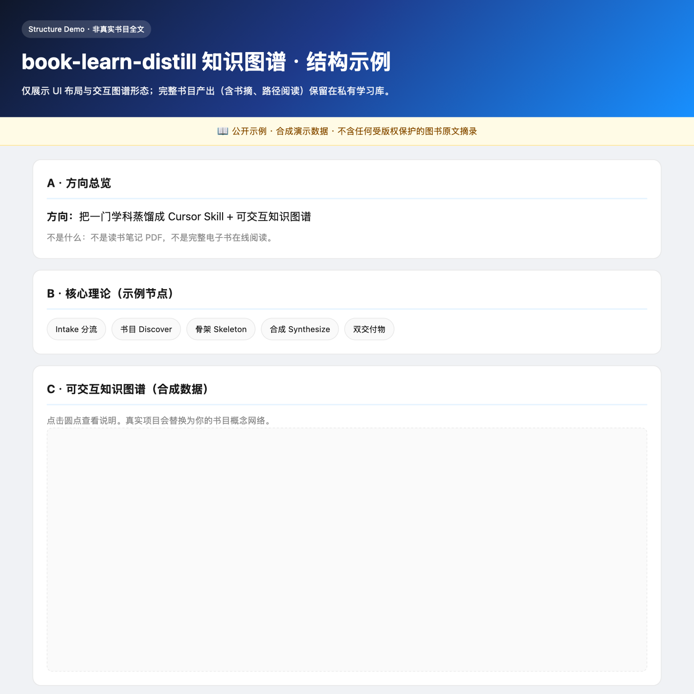

# qian-public

> **唯一公开仓库** · book-learn-distill Skill + 结构示例 Demo  
> 作者：[muqian2026-rgb](https://github.com/muqian2026-rgb)

[](https://muqian2026-rgb.github.io/qian-public/demo/pipeline-structure-demo.html)

↑ 点击预览图 **[在线打开结构示例 →](https://muqian2026-rgb.github.io/qian-public/demo/pipeline-structure-demo.html)**（合成数据，不含图书原文）

---

## 这里有什么

| 路径 | 是什么 |
|------|--------|
| [book-learn-distill/](./book-learn-distill/) | 读书 → Skill + 知识图谱 的流水线（可 fork 安装） |
| [在线 Demo](https://muqian2026-rgb.github.io/qian-public/demo/pipeline-structure-demo.html) | **结构示例**：UI + 交互图谱形态，非真实书目全文 |

**不公开**：完整书目产出（书摘、路径阅读、书内问答）保留在私有学习库，尊重原著版权。

---

## 快速开始

```bash
git clone https://github.com/muqian2026-rgb/qian-public.git
cp -r qian-public/book-learn-distill ~/.cursor/skills/book-learn-distill
```

在 Cursor 里说：

```
学一下 行为经济学
```

Agent 按流水线执行，在**你的私有库**生成完整 Skill + 知识图谱。

详见 [book-learn-distill/README.md](./book-learn-distill/README.md)。

---

## 公开 Demo vs 完整版

| | 公开 Demo | 完整版（私有） |
|---|-----------|----------------|
| 知识图谱节点 | 合成示例（流水线阶段） | 真实书目概念网络 |
| 路径阅读 E 区 | 🔒 不展示 | 章节原文摘录 |
| 书内问答 K 区 | 🔒 不展示 | AI Persona + 原文检索 |
| 用途 | 看 UI 形态、决定是否 fork | 个人深度学习 |

---

## Star 这个仓库，如果你

- 想把「读书」变成可复用的 Cursor Skill
- 需要知识图谱 HTML 的模板与构建脚本
- 在做 AI 学习 / 蒸馏工作流

---

## 反馈

[GitHub Issues](https://github.com/muqian2026-rgb/qian-public/issues)

---

*Last updated: 2026-06-08*
