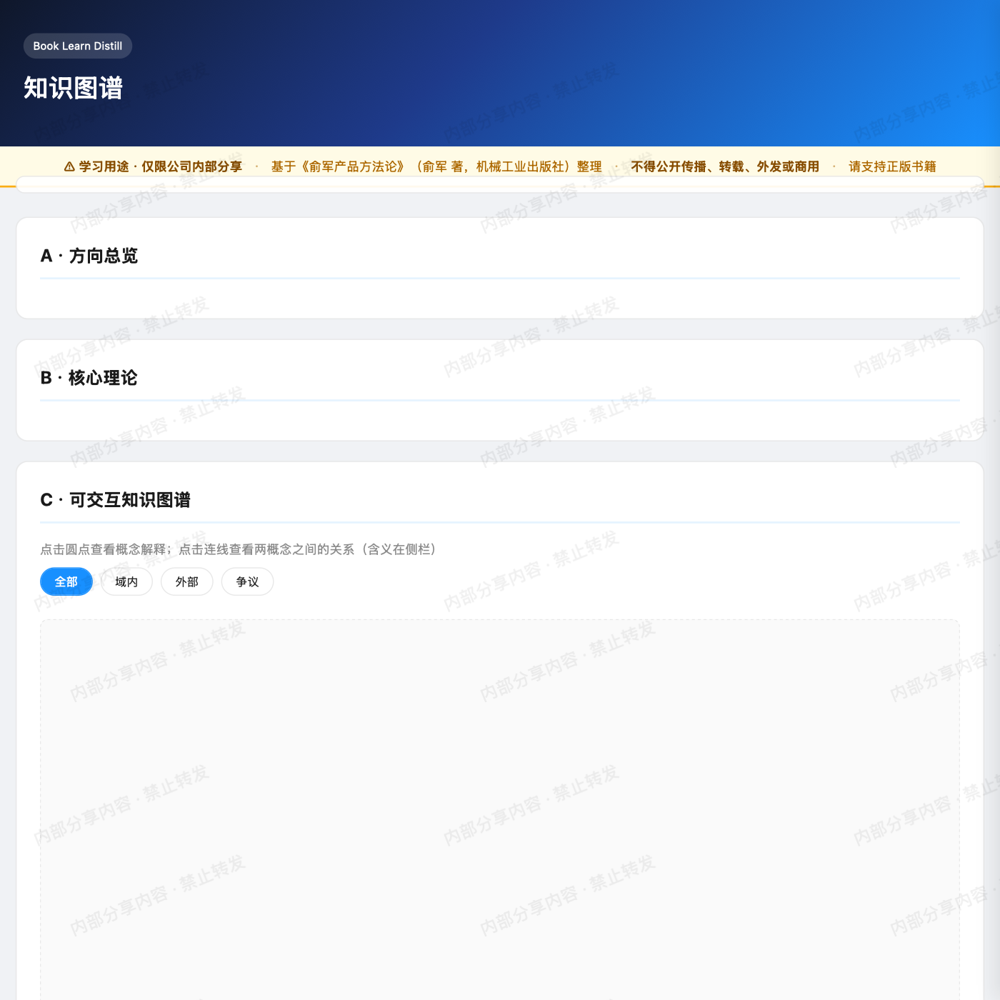

# qian-public

> **唯一公开仓库** · 作品集 + 可 fork 的 Agent Skill + 精选知识图谱 demo  
> 作者：[muqian2026-rgb](https://github.com/muqian2026-rgb)

[](https://muqian2026-rgb.github.io/qian-public/demo/yujun-product-methodology.html)

↑ 点击预览图 **[在线打开知识图谱 Demo →](https://muqian2026-rgb.github.io/qian-public/demo/yujun-product-methodology.html)**

---

## 这里有什么

| 路径 | 是什么 | 适合谁 |
|------|--------|--------|
| [book-learn-distill/](./book-learn-distill/) | 读书 → Domain Skill + 知识图谱 HTML 的 11 阶段流水线 | 用 Cursor / Claude Code 做「学一门课」的人 |
| [examples/](./examples/) | 流水线产出示例（可离线打开的 HTML） | 想看最终长什么样的人 |
| **[在线 Demo](https://muqian2026-rgb.github.io/qian-public/)** | GitHub Pages 托管，浏览器直接看 | 不想 clone 的人 |

私有工作区（滴滴 / fitwow / 个人蒸馏）不对外公开。

---

## 快速开始 · book-learn-distill

```bash
git clone https://github.com/muqian2026-rgb/qian-public.git
cp -r qian-public/book-learn-distill ~/.cursor/skills/book-learn-distill
# Claude Code 用户：~/.claude/skills/book-learn-distill
```

在 Cursor 里说：

```
学一下 行为经济学
```

Agent 按 Skill 内 8–11 阶段流水线执行，产出 Domain Skill + 知识图谱 HTML。

详见 [book-learn-distill/README.md](./book-learn-distill/README.md)。

---

## 示例预览

- **在线**：https://muqian2026-rgb.github.io/qian-public/demo/yujun-product-methodology.html
- **本地**：打开 [examples/yujun-product-methodology_知识图谱.html](./examples/yujun-product-methodology_知识图谱.html)

---

## Star 这个仓库，如果你

- 想把「读书」变成可复用的 Cursor Skill
- 需要知识图谱 HTML 的模板与脚本
- 在做 AI 学习 / 蒸馏工作流

---

## 反馈

[GitHub Issues](https://github.com/muqian2026-rgb/qian-public/issues)

---

*Last updated: 2026-06-08*
