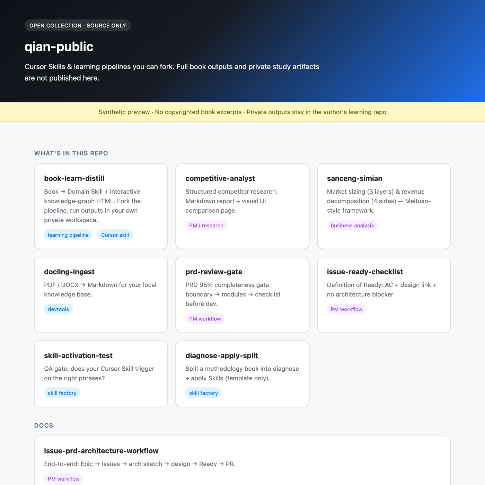

# qian-public

> **为什么 fork？** 把书蒸馏成 Cursor Skill，用 PRD / Issue Ready 门禁跑产研——一套可复制的 PM + AI 工作流，fork 即用，产出留在你的私有库。

> **Open collection** · book-learn-distill + Cursor Skills toolbox  
> by [muqian2026-rgb](https://github.com/muqian2026-rgb)

[](https://muqian2026-rgb.github.io/qian-public/demo/collection-preview.html)

↑ **[Collection preview →](https://muqian2026-rgb.github.io/qian-public/demo/collection-preview.html)** (English · schematic only)

---

## 这里有什么

| 路径 | 是什么 |
|------|--------|
| [book-learn-distill/](./book-learn-distill/) | 读书 → Skill + 知识图谱 |
| [skills/](./skills/) | PM 门禁、调研分析、Skill 工厂、工具链（8 个） |
| [docs/issue-prd-architecture-workflow.md](./docs/issue-prd-architecture-workflow.md) | Issue · PRD · 架构 端到端流程 |
| [docs/xiaozhi-esp32-private-deployment.md](./docs/xiaozhi-esp32-private-deployment.md) | **ESP32 小智私有化部署实录**（架构 · 路径 · 踩坑） |

**不公开**：书目全文、深读原文、公司内部数据——保留在私有学习库。

---

## 快速开始

```bash
git clone https://github.com/muqian2026-rgb/qian-public.git
cp -r qian-public/book-learn-distill ~/.cursor/skills/book-learn-distill
cp -r qian-public/skills/prd-review-gate ~/.cursor/skills/prd-review-gate
```

在 Cursor 里说：

```
学一下 行为经济学
PRD review this spec
issue ready check
```

完整产出在**你的私有库**生成；本仓库提供 Skill 源码。

---

## Skills 工具箱

| Skill | 口令示例 |
|-------|----------|
| prd-review-gate | PRD review / review this PRD |
| issue-ready-checklist | issue ready / ready for dev |
| competitive-analyst | 调研 XX 赛道竞品 |
| sanceng-simian | 三层四面拆一下这个市场 |
| skill-activation-test | run skill activation test for … |
| diagnose-apply-split | split diagnose apply for … |
| docling-ingest | docling 转一下这个 PDF |

详见 [skills/README.md](./skills/README.md)。

---

## Star 这个仓库，如果你

- 想把「读书」变成可复用的 Cursor Skill
- 需要 PRD / Issue Ready 门禁或竞品分析模板
- 在做 AI 学习 / 蒸馏 / PM 产研工作流

---

## 反馈

[GitHub Issues](https://github.com/muqian2026-rgb/qian-public/issues)

---

*Last updated: 2026-06-25*
