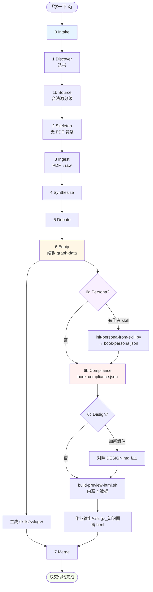

# book-learn-distill · 工程架构

> **版本**：v0.4（架构定稿）  
> **配套**：[Skill 入口](../SKILL.md) · [README](../README.md)  
> **目的**：给团队 / 接手人 / 法务 / 自己半年后看的工程交接文档。

---

## 1. 设计目标

把「读一本书」做成可重复 / 可继承 / 可合规的流水线：

| 输入 | 一个学习方向 + 一本（或几本）权威书的合法源 |
|---|---|
| **过程** | 11 阶段流水线（含 3 个可选阶段），全程文件驱动、可暂停可续跑 |
| **输出** | ① Domain Skill（Agent 可调用）② 知识图谱 HTML（人可探索）③ wiki 沉淀（机器复用） |
| **质量** | AI 模拟视角 + 原文索引 + 合规水印 + 设计系统血缘 |

---

## 2. 总览图



---

## 3. 11 阶段流程

| 阶段 | 输入 | 输出 | 门禁 | 状态机 |
|---|---|---|---|---|
| 0 Intake | 方向一句话 | `meta.json` | 方向确认 | `intake` |
| 1 Discover | 方向 | `01-book-shortlist.md` | **确认书目** | `books_confirmed` |
| 1b Source | 入选书 | `01b-source-discovery.md` | **确认合法源** | - |
| 2 Skeleton | 目录/书评 | `02-skeleton.md` | **确认骨架** | `skeleton_confirmed` |
| 3 Ingest | PDF | `raw/books/*.md` | docling 完成 | `ingesting` |
| 4 Synthesize | raw | `03-core-synthesis.md` | **确认理论+争议** | `synthesis_confirmed` |
| 5 Debate | 争议表 | `04-human-review.md` | **确认立场** | - |
| 6 Equip | 全部 | `06-graph-data.json` + `knowledge-graph.html` + `skills/<slug>/` | **确认图谱** | `graph_confirmed` / `equipped` |
| **6a Persona**（可选） | 作者 skill | `book-persona.json` | 命中率 ≥ 80% | - |
| **6b Compliance** | - | `book-compliance.json` | **法务可接受** | `compliance_confirmed` |
| **6c Design Calibration**（可选） | 新组件 | 对照 `DESIGN.md` | 血缘一致 | - |
| 7 Merge | 全部 | `05-merge-diff.md` | **确认合并策略** | `merged` |

---

## 4. 资源清单（4 类）

### 4.1 AI Skill（7 主线 + 1+ Persona）

| Skill | 角色 | 阶段 |
|---|---|---|
| **book-learn-distill** ★ | 主链 | 0 → 7 全程 |
| docling-ingest | PDF→MD | 3 |
| WIKI_SCHEMA | raw→wiki | 3 后 |
| d3-charts | 图谱微调 | 6（可选） |
| excalidraw-diagram | 流程草图 | 6（可选） |
| task-orchestrator | 多任务调度 | 入口 |
| **design-md** | 设计系统蒸馏 | 6c |
| `~/.claude/skills/<author>.md` | Persona 源 | 6a（按书） |

### 4.2 自动化脚本（11 个 · `skills/book-learn-distill/scripts/`）

| 脚本 | 阶段 | 作用 |
|---|---|---|
| `find-existing.sh` | 1 | 扫已有同方向 |
| `discover-sources.sh` | 1b | 登记合法源 |
| `build-book-index.py` | 3 | raw → 234 段索引 |
| `build-book-framework-tree.py` | 3 | raw → 章节树 |
| `enrich-yujun-framework.py` | 4-5 | 项目级补 keyPoints（专用） |
| `merge-book-supplement.py` | 6 | glossary+misc → graph-data |
| `merge-framework-enrichment.py` | 6 | keyPoints → frameworkTree |
| `merge-node-enrichment.py` | 6 | 节点深度数据 |
| **`init-persona-from-skill.py`** | 6a | 作者 skill → persona 初稿 |
| **`build-preview-html.sh`** | 6 | 内联 4 数据 → 最终 HTML |
| `sync-global-skills.sh` | 7 | 同步到 `~/.claude/skills/` |

### 4.3 Prompts（7 份 · `prompts/`）

| Prompt | 阶段 |
|---|---|
| `intake.md` | 0 |
| `book-rubric.md` | 1 |
| `source-discovery.md` | 1b |
| `synthesis-template.md` | 4 |
| `skill-abstract.md` | 6 |
| **`persona-template.md`** | 6a |
| **`compliance-template.md`** | 6b |

### 4.4 Templates（5 个 · `templates/`）

| 模板 | 类型 |
|---|---|
| `knowledge-graph.html` | UI 骨架 + CSS |
| `knowledge-graph.js` | 交互（popover/RAG/persona/水印） |
| `graph-data.schema.json` | 主数据契约 |
| **`book-persona.schema.json`** | persona 契约 |
| **`DESIGN.md`** | 设计语言通用源 |

---

## 5. 数据流（每本书 ~14 个产物）

```
learn/<slug>/
├── meta.json                          ← 状态机
├── 01-book-shortlist.md
├── 01b-source-discovery.md
├── 02-skeleton.md
├── 03-core-synthesis.md
├── 04-human-review.md
├── 05-merge-diff.md
├── 06-graph-data.json    ◀════ 4 个 merge 脚本写
├── book-index.json       ◀════ build-book-index.py
├── book-glossary.json
├── book-misconceptions.json
├── book-node-enrichment.json
├── book-framework-enrichment.json
├── book-framework-tree.json
├── book-persona.json     ◀════ init-persona-from-skill.py
├── book-compliance.json  ◀════ 手写（默认或覆写）
├── DESIGN.md             ◀════ 复制 templates/DESIGN.md
└── knowledge-graph.html  ◀════ build-preview-html.sh 同步副本
```

**build script 内联 4 个全局变量到最终 HTML**：

| 全局变量 | 来源文件 | 优先 fallback |
|---|---|---|
| `window.GRAPH_DATA` | `06-graph-data.json` | 必需 |
| `window.BOOK_INDEX` | `book-index.json` | 可选 |
| `window.PERSONA` | `book-persona.json` → `author-persona.json` → `yujun-persona.json` | 可选 |
| `window.COMPLIANCE` | `book-compliance.json` → `compliance.json` | 可选，默认配置兜底 |

**最终交付**：

```
作业输出/<slug>_知识图谱.html   ← 单文件、可断网、内联全部数据
skills/<slug>/                  ← Domain Skill
```

---

## 6. 关键契约

### 6.1 `06-graph-data.json` 顶层

```jsonc
{
  "meta": { "title", "slug", "books", "updated", "compliance"? },
  "theory": {
    "oneLiner",
    "frameworkTree": [...],     // 章节树 + summary + keyPoints
    "pillars": [...],
    "decisionGuide": {...}
  },
  "nodes": [...],               // C 区图谱节点（含 mechanism/quotes/sectionRef）
  "edges": [...],
  "glossary": [...],            // J 区
  "misconceptions": [...],      // I 区
  "readingPath": [...]          // E 区目录（已由 frameworkTree 自动派生）
}
```

### 6.2 `book-persona.json` 顶层

```jsonc
{
  "persona": { "name", "tagline", "intro", "principles": [...] },
  "models": [
    {
      "id", "title",
      "keywords": [...],        // 命中算法：q.includes(k) → score += k.length
      "core",                   // 支持 **加粗**（深色卡渲染琥珀色）
      "callout",                // 金句
      "questions": [...],       // 作者会反问 2-4 条
      "bookSearchTerms": [...], // 扩展词
      "sectionRefs": [...]      // 命中时 chunk boost +5
    }
  ]
}
```

详见 `templates/book-persona.schema.json` + `prompts/persona-template.md`。

### 6.3 `book-compliance.json` 顶层

```jsonc
{
  "enabled": true,              // false → 全部合规元素不渲染
  "banner": "顶部警示文案",
  "watermark": "全屏对角水印短句",
  "noCopy": true,
  "noContextMenu": true,
  "footer": {
    "copyright", "curator", "contact",
    "aiNote",         // Persona 用时必填
    "personalNote",   // 个人解读时必填
    "takedown"
  }
}
```

详见 `prompts/compliance-template.md`（含三种典型场景）。

---

## 7. UI 区块（9 个 · 已删 D / F）

| 区块 | 内容 | 关键交互 |
|---|---|---|
| A 方向总览 | 一句话 + 不是什么 | - |
| B 核心理论 | B1 frameworkTree（叶子显示 summary，关键词点击 popover） | popover / chips |
| C 知识图谱 | D3 力导向图，节点点击侧栏（含 sectionRef 阅读原文） | sidebar / D3 |
| E 路径阅读 | 左 sticky 章节树（5 章 + 20 节），右 docs 风格正文 | 双栏 docs |
| **K 书内问答** | 命中 Persona → 作者视角卡 + 反问；否则摘录卡。下方 3 段原文巩固 | RAG-style |
| G 与已有认知 | 链接到已有 wiki | - |
| H 应用桥 | → Domain Skill | - |
| I 常见误区 | 对错对比卡 + 章节筛选 | filter |
| J 术语云 | 搜索 + 章节着色 + 详情面板 | search + popover |

> ⚠ 已移除：~~D 争议与解读~~（与 B/I 冗余）、~~F 证据~~（合并入节点 sidebar）

---

## 8. 扩展点

### 8.1 加一本新书

```bash
# 1. 启动 skill
「学一下 <方向>」 / 「/book-learn <方向>」

# 2. 走 0 → 6 阶段（每阶段等确认）

# 3. 阶段 6a：起 persona（如有作者 skill）
python3 skills/book-learn-distill/scripts/init-persona-from-skill.py \
  --skill ~/.claude/skills/<author>.md \
  --out learn/<slug>/book-persona.json \
  --name "作者名" --tagline "身份标签"

# 4. 阶段 6b：复制合规配置
cp learn/yujun-product-methodology/book-compliance.json learn/<slug>/
# 改 copyright/curator/aiNote 等

# 5. build
bash skills/book-learn-distill/scripts/build-preview-html.sh <slug>
```

### 8.2 加新 UI 组件

**先做这件事**：打开 `templates/DESIGN.md`，按 §11 元规则对照「最接近的参考件」：

1. 永远 panel-card + hairline border + 12px 圆角
2. 任何新颜色都先看第 2 节是否已有
3. 暗色块只出现在「Hero / Answer Card / 重要 callout」
4. 任何 chip/tag 都是「浅底 + 深字 + 1px 同色 border」三件套
5. 加阴影前先考虑是否能用 border 解决

### 8.3 加新合规场景

`prompts/compliance-template.md` 已含三种典型：
- A 内部敏感（默认）
- B 开放课堂（无水印有署名）
- C 公有领域/原创（全关）

新场景直接在 `book-compliance.json` 覆写字段即可，无需改代码。

---

## 9. 已知限制 & 防御

| 限制 | 性质 | 防御 |
|---|---|---|
| 禁复制只能挡 95% 顺手党 | 技术限制 | 加水印 + 内网部署 + 文件名带版本号 |
| Persona 是确定性意图路由，非真 LLM | 设计选择 | 浏览器内 0 成本可断网；未来可接 LLM API |
| pdftotext 抽取偶有 OCR 错误（"r" / "Lvory"） | 上游数据 | `cleanChunkText` 已做 7 类正则清洗 |
| K 区检索是词频匹配（非语义） | 技术取舍 | glossary + persona keywords 扩展词覆盖 |
| 单页 HTML（含全书索引）可能达 5MB+ | 文件大小 | 浏览器仍流畅；如需可拆分 `<slug>.css` |
| 全文索引依赖 PDF 合法性 | 法务 | 阶段 1b 强制分级 Tier A-X，禁用 X |

---

## 10. 升级日志

| 版本 | 日期 | 主要变化 |
|---|---|---|
| v0.1 | 2026-05-15 | 计划沉淀 |
| v0.2 | 2026-05-17 | 主编排 + 7 个脚本 + HTML 模板落地 |
| v0.3 | 2026-05-19 | 接入 docling + WIKI_SCHEMA + 首书俞军方法论 |
| **v0.4** | **2026-05-20** | **新增 6a Persona / 6b Compliance / 6c Design；K 区取代 D；通用化文件名；DESIGN.md 沉淀** |

---

## 11. 一句话总结

> 11 阶段 × 7 Skill × 11 脚本 × 7 Prompts × 5 Template，让「读一本书」变成可继承、可合规、可重复的工程流水线，单 HTML 文件可断网交付。

---

**维护人**：[你的名字]  
**最近更新**：2026-05-20  
**反馈**：在 `learn/<slug>/05-merge-diff.md` 留 issue，或直接改本文件加版本号。
