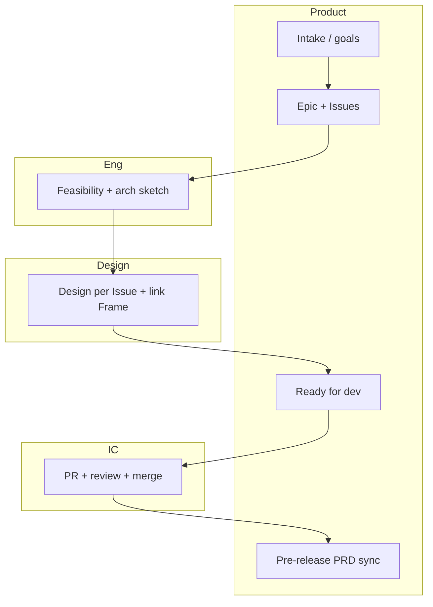

# Issue · PRD · Design · Architecture Workflow

> **Audience**: PM, design, engineering leads, ICs  
> **Version**: 1.0 (public copy, de-identified)  
> **Companion skills**: [issue-ready-checklist](../skills/issue-ready-checklist/) · [prd-review-gate](../skills/prd-review-gate/)

---

## 1. Why change the old order?

**Old order**: understand users → write PRD → design → PRD review → tech review → architecture.

**Problems**:

- Architecture too late — APIs, data, multi-platform, performance buried in PRD; design locks, then eng says "can't build / need UX change"
- PRD tries to be both strategy and every pixel — expensive reviews
- Meetings say "approved" but GitHub has no **Issues / AC** — alignment stays verbal

**Goal**: keep PRD + design + tech gate, but **reorder carriers** so architecture appears earlier and rework drops.

---

## 2. Recommended stages & gates

Organize as **Epic → Issue list → parallel tracks → gates → PR**, not one serial line.

| Stage | Purpose | Main outputs | Lead |
|-------|---------|--------------|------|
| **A. Intake** | Problem, scope, non-goals | 1-page Intake or Epic + metrics (optional) | PM |
| **B. Breakdown** | Independently shippable, testable | Epic + Issues (Context, Goal, **AC draft**, deps) | PM + Eng (short sync) |
| **C. Feasibility / arch sketch** | Avoid surprises after PRD lock | Light arch: modules, key APIs, data changes, risks; time-boxed **spike** if needed | TL (PM listens) |
| **D. Design + PRD delta** | Visual + long-term truth | Design per Issue/module; **master PRD § delta** + revision log; Issue links Frame/export | Design + PM |
| **E. Review gate** | Fewer useless meetings | **Issue-level Ready**: AC done, design linked, no arch **blocker** | PM + TL (async OK) |
| **F. Build & merge** | Traceable, revertible | PR links Issue; review vs AC; DoD (tests, PRD backfill if needed) | IC + Reviewer |

**Key sequence**: **Architecture (C) after breakdown (B), before full design lock (D)** — depth "enough to decide", details live in Issues / ADRs.

---

## 3. Roles & async handoffs

1. **PM → all**: Epic / Issue drafts (AC template in each Issue)
2. **Eng → PM**: Comment risks, deps, split/merge suggestions on Issue; 15–30 min sync if needed — conclusions in Issue
3. **TL → PM / Design**: Tech boundary note on Epic or lead Issue (reuse, migrations, interaction constraints)
4. **Design → PM**: Priority frames; **each Frame maps to Issue or PRD §**
5. **PM → Eng**: Mark **Ready for dev** (AC + design link + no blocker)
6. **Eng → PM**: After merge, update master PRD via docs PR or DoD item when behavior changed

**Systems**: GitHub Issues/PR for work; **master PRD** as versioned contract; design exports as attachments; architecture in Epic + ADR when major.

---

## 4. Map from old process

| Old step | In new flow |
|----------|-------------|
| Write full PRD first | Intake + Epic + Issues; PRD **incremental by §** |
| Design deliverable | Same, **bound to Issues** |
| PRD review | Split: Issue/Epic scope + AC review; pre-release PRD milestone |
| Tech review | **B→C feasibility + gate**; big changes → dedicated review |
| Architecture | **Early sketch**, evolves with PRs; ADR for big calls |

---

## 5. Minimum viable switch (do these three first)

1. Every large request: **Epic + child Issues + AC each** — no AC, no dev  
2. Dev gate: **Ready = AC + design link + TL no blocker**  
3. Pre-release: **master PRD revision log** matches merged PRs this release  

---

## 6. Swimlane

---

## Related in this repo

- Skill: [issue-ready-checklist](../skills/issue-ready-checklist/SKILL.md)
- Skill: [prd-review-gate](../skills/prd-review-gate/SKILL.md)
- Learning pipeline: [book-learn-distill](../book-learn-distill/)
